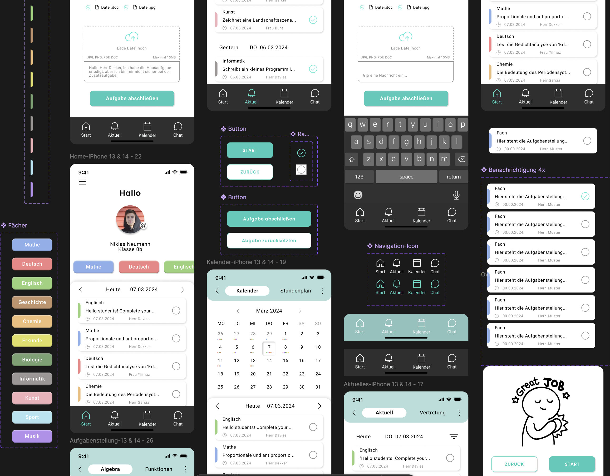

# Digital Homework App 📚  

## 🎯 Project Description  
This app was designed as a UX/UI project for students (ages 12–16) to help them manage their homework efficiently. Teachers can assign tasks digitally, and students can track their deadlines.  

This project was developed as part of a one-week UX/UI design sprint. Due to the limited timeframe, only the most essential core functions were implemented to present a user-friendly concept.  

## 📝 Features  
✅ Overview of all homework with due dates  
✅ Ability to check off completed tasks  
✅ Categorization by subject  
✅ Detailed task descriptions  

## 📌 Screenshots  
  

## 🔗 Figma Prototype  
[Click here to view the prototype in Figma](https://www.figma.com/design/vOq14CeGw7J5nh8aTtu85G/Merve_Balcok_Abschlussprojekt?node-id=117-8575&t=a22L9bVY17tptmwc-1)  

## ✨ Design Decisions  
- Focus on essential features for quick and efficient task management  
- Clear, intuitive user interface  
- Color coding for better subject distinction  
- Simple checkbox function for marking tasks as completed  

---

Since this project was completed within a week, the focus was on creating a solid foundation that can be further developed if needed.  
